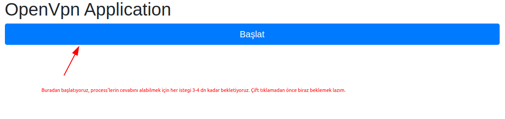
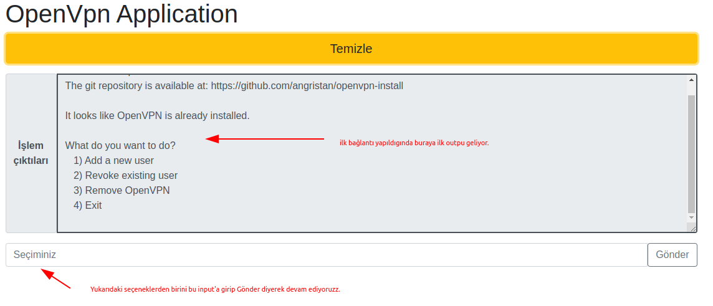

# frontend-spring-boot-vue-crud-full-stack

## Nodejs & npm setup
https://github.com/nodesource/distributions

Note: v17.x or older version should be installed.

## Project setup
```
npm install
```

## Used modules
```
npm install -g @vue/cli
npm add axios
npm add vue-router

npm install uuid
```

### Compiles and hot-reloads for development
```
npm run serve
```

  App running at:
  - Local:   http://localhost:8081/ 
  - Network: http://192.168.1.22:8081/


### Compiles and minifies for production
```
npm run build
```

### Lints and fixes files
```
npm run lint
```

### Customize configuration
See [Configuration Reference](https://cli.vuejs.org/config/).

### GUI Usage

- GUI 1<br>
<br>
- GUI 2<br>
<br>
